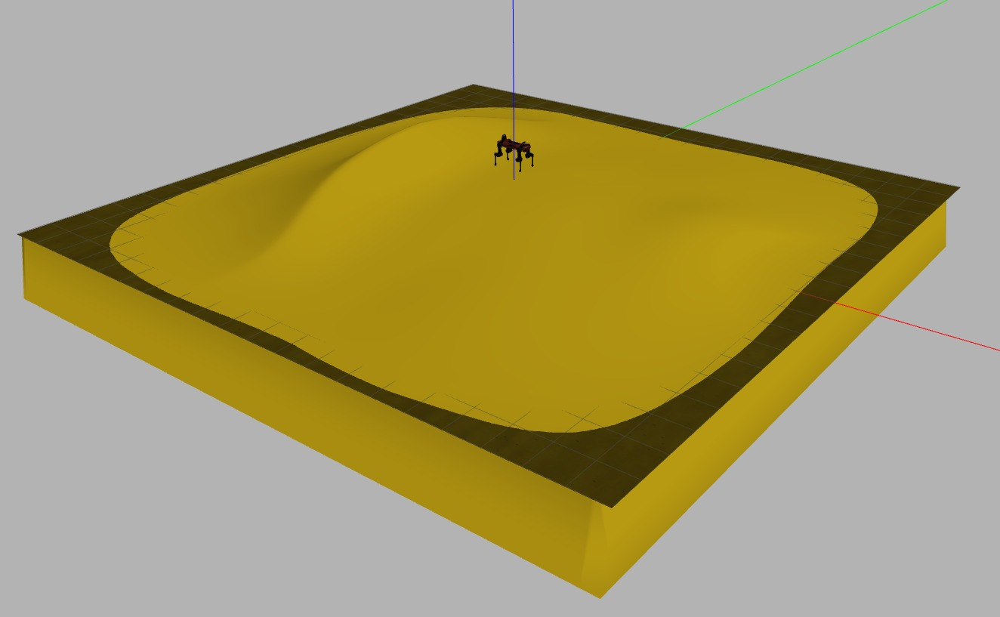
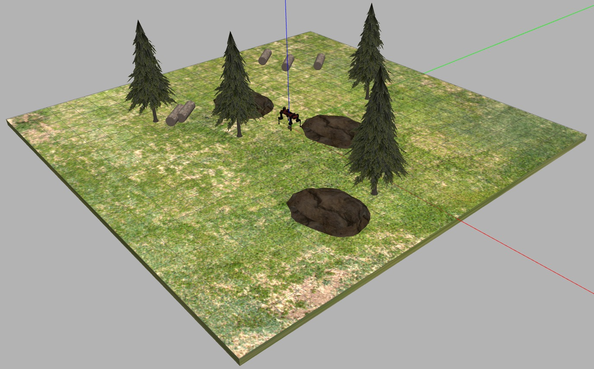

## How to run a simulation

- Copy the whole simulation folder *anymal_c* in your catkin_ws/src 
- ``` $ catkin_make ```
- ``` $ export GAZEBO_MODEL_PATH=~/catkin_ws/src/anymal_c/anymal_c_gazebo/models:$GAZEBO_MODEL_PATH ```

    substituting *catkin_ws* with yout workspace
- ``` $ roslaunch anymal_c_gazebo <seleceted_file>.launch ```

### World Example

- Dune



- Forest


