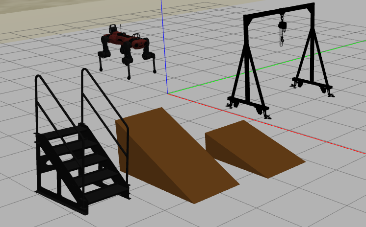

## How to customize a world

Modify .world file in *anymal_c_gazebo/worlds* including other models presents in the *anymal_c/models* folder, replacing `<MODEL>` with your selected model in a wolrd file, example:

  ```
<?xml version="1.0" ?>
<sdf version="1.4">
  <world name="default">

    <!-- Global light source -->
    <include>
      <uri>model://sun</uri>
    </include>

    <include>
      <uri>model://dune</uri>
    </include>
    
    <include>
      <uri>model://sand_plane</uri>
    </include>
    
    <include>
      <uri>model://<MODEL></uri>
    </include>
    
  </world>
</sdf>
  ```
  
## Example of a Gazebo world populated with random models

World populated with anymal_c urdf and stairs, ramp1, ramp2, manual_crane models


