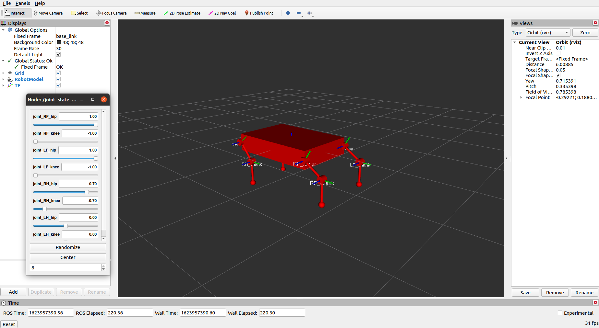
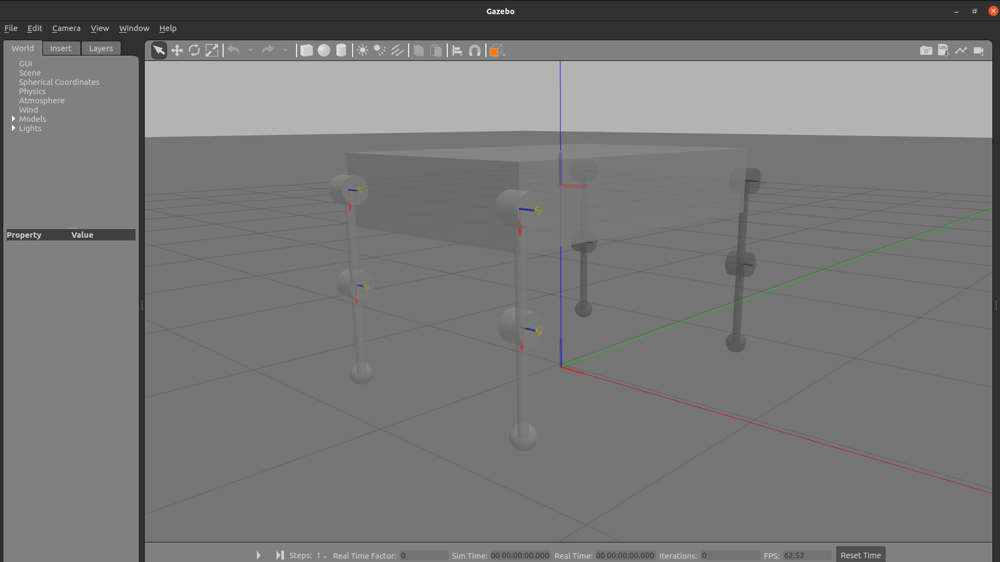

## Goat Robot Model

This folder includes 3 ROS packages to create and use the first version of a simple goat robot model.

### Prerequisites

The above packages are tested on ROS Noetic and the main external dependency is the following:

* [`goat_plugin`](https://github.com/CentroEPiaggio/NaturalIntelligence/tree/main/NI_simulations/goat_plugin)

Used to integrate the serial elasti actuator in each joint and command the robot via the plugin manager.

### How to spawn the robot

- Copy the whole simulation folder *first_goat* in your catkin_ws/src 
- ``` $ catkin_make ```

To visualize the robot in Rviz
- ``` $ roslaunch goat_description rviz.launch ```

To spawn the robot in Gazebo
- ``` $ roslaunch goat_gazebo goat_spawn.launch ```

### How to test a control

Through the plugin manager it is possible to send a theta reference value for each joint. \
The default demo command, setted in *goat_command/src/give_command.cpp*, is a sinusoidal signal to move the robot base up and down. \
It is has been provided just to present a way to control the robot via the plugin manager, for more details about the manager check this [link](https://github.com/NMMI/ROS-Gazebo-plugin-qbmove).

- Copy the whole simulation folder *first_goat* in your catkin_ws/src 
- ``` $ catkin_make ```

In a first shell
- ``` $ roslaunch goat_gazebo goat_spawn.launch ```

In a second shell
- ``` $ roslaunch goat_command set_command.launch ```


## Example of robot visualisation

- Rviz



- Gazebo


