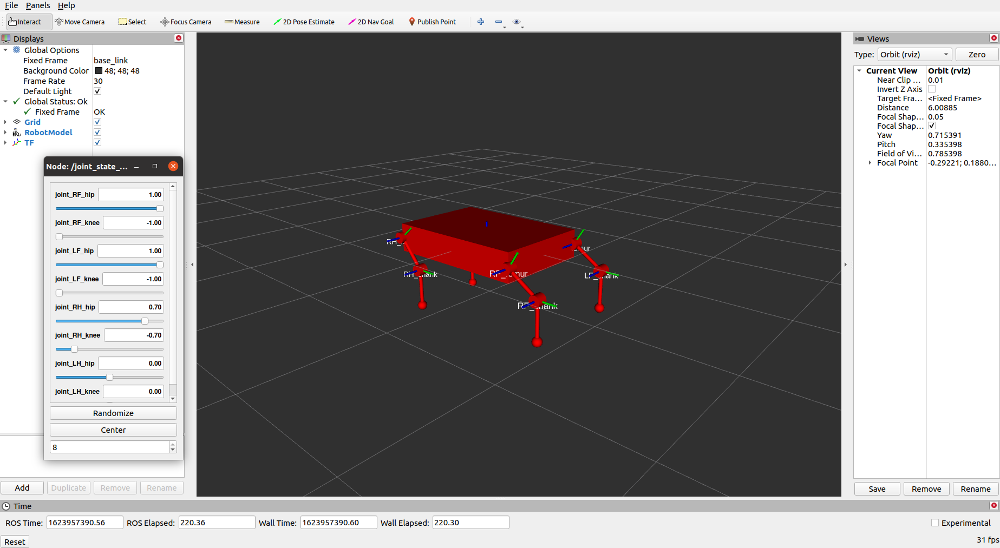
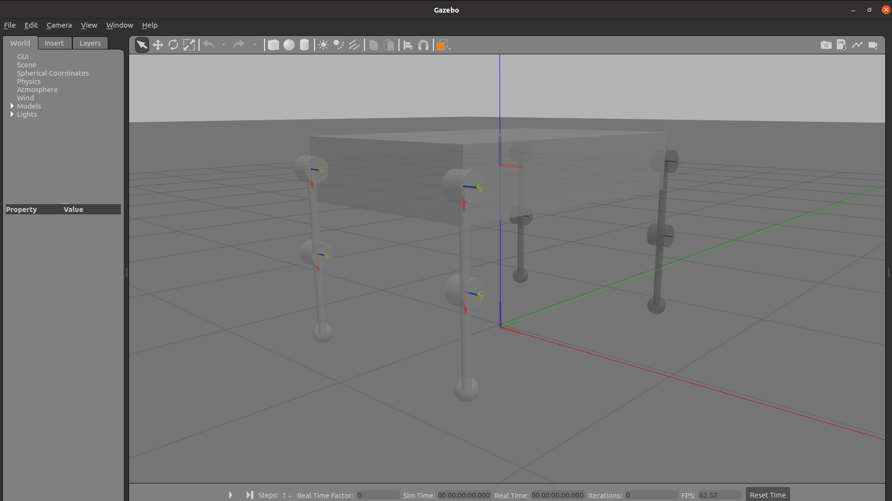

## Goat Robot Model

This folder includes 4 ROS packages to create and use the first version of a simple goat robot model.

### How to spawn the robot

- Copy the whole simulation folder *first_goat* in your catkin_ws/src 
- ``` $ catkin_make ```

To visualize the robot in Rviz
- ``` $ roslaunch goat_description rviz.launch ```

To spawn the robot in Gazebo
- ``` $ roslaunch goat_gazebo goat_spawn.launch ```

### How to command the robot

Through the plugin manager it is possible to send a theta reference value for each joint.
The default command setted in *goat_command/src/give_command.cpp* is an alternate sinusoidal demo signal to move the robot base up and down.

- Copy the whole simulation folder *first_goat* in your catkin_ws/src 
- ``` $ catkin_make ```
In a first shell
- ``` $ roslaunch goat_gazebo goat_spawn.launch ```
In a second shell
- ``` $ roslaunch goat_command set_command.launch ```

####

## Example of robot visualisation

- Rviz



- Gazebo


